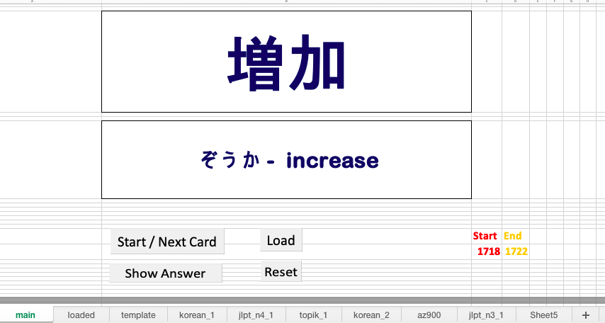
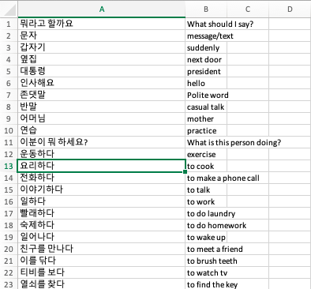

# Excel VBA Flashcard Tool

An interactive, Excel-based flashcard application built for targeted language learning and memorization. Driven by Excel VBA macros, it enables users to study custom vocabulary ranges, practice card drills, and manage structured question/answer databases across sheets.



## 🚀 Features

* **Start / Next Card:** Randomly pulls or sequences the next word onto the primary display.
* **Show Answer:** Reveals the corresponding translation, reading, or answer instantly.
* **Load System:** Dynamically copies target data rows from the `template` sheet over to the active `loaded` execution sheet.
* **Reset Function:** Replays the active deck from row 1 using the current snapshot in the `loaded` sheet.
* **Custom Range Selection:** Enter a specific **Start** and **End** index (e.g., 1718 to 1722) to study a smaller section instead of the entire list.

## 🛠️ Data Setup & Workflow

To study a new deck of vocabulary cards, follow this exact workflow:

### Step 1: Create Your Vocabulary List
1. Create a **new blank sheet** in your workbook (e.g., name it `korean_1` or `jlpt_n3_1`).
2. Set up your vocabulary data using this two-column layout starting at row 1:

| Column A (Front of Card) | Column B (Back / Answer) |
| :--- | :--- |
| 요리하다 | to cook |
| 문자 | message/text |



### Step 2: Push Data to the Flashcard Engine
1. Select and **copy** all your vocabulary rows from your new sheet.
2. Go to the **`template` sheet** and **paste** the copied data into columns A and B (replacing any old values).
3. Switch back to your **`main` sheet** and click the **Load** button. 
   * *This triggers the macro to copy everything from `template` over to the `loaded` execution sheet, preparing your deck.*

### Step 3: Configure Range and Play
1. *(Optional)* Input your target row numbers into the **Start** and **End** cells if you want to focus on a small section.
2. Click **Start / Next Card** to begin practicing.

## 📄 License

This project is licensed under the MIT License - see below for details:

```text
MIT License

Copyright (c) 2026

Permission is hereby granted, free of charge, to any person obtaining a copy
of this software and associated documentation files (the "Software"), to deal
in the Software without restriction, including without limitation the rights
to use, copy, modify, merge, publish, distribute, sublicense, and/or sell
copies of the Software, and to permit persons to whom the Software is
furnished to do so, subject to the following conditions:

The above copyright notice and this permission notice shall be included in all
copies or substantial portions of the Software.

THE SOFTWARE IS PROVIDED "AS IS", WITHOUT WARRANTY OF ANY KIND, EXPRESS OR
IMPLIED, INCLUDING BUT NOT LIMITED TO THE WARRANTIES OF MERCHANTABILITY,
FITNESS FOR A PARTICULAR PURPOSE AND NONINFRINGEMENT. IN NO EVENT SHALL THE
AUTHORS OR COPYRIGHT HOLDERS BE LIABLE FOR ANY CLAIM, DAMAGES OR OTHER
LIABILITY, WHETHER IN AN ACTION OF CONTRACT, TORT OR OTHERWISE, ARISING FROM,
OUT OF OR IN CONNECTION WITH THE SOFTWARE OR THE USE OR OTHER DEALINGS IN THE
SOFTWARE.
```
